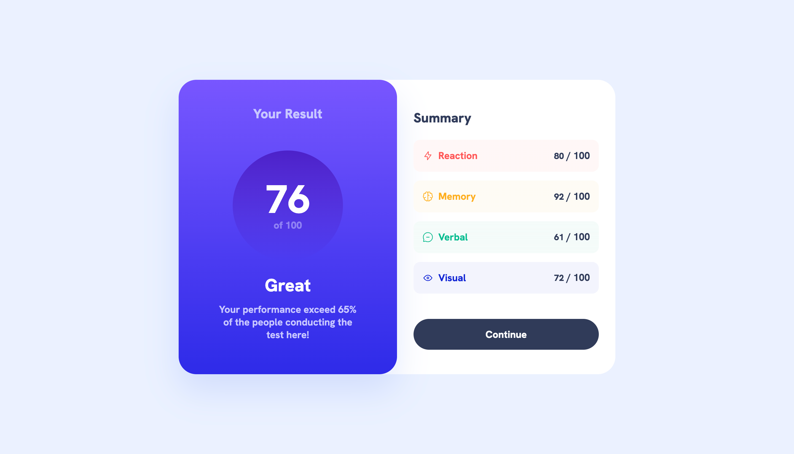

# Frontend Mentor - Results summary component solution

This is a solution to the [Results summary component challenge on Frontend Mentor](https://www.frontendmentor.io/challenges/results-summary-component-CE_K6s0maV). Frontend Mentor challenges help you improve your coding skills by building realistic projects.

## Table of contents

- [Overview](#overview)
  - [The challenge](#the-challenge)
  - [Screenshot](#screenshot)
  - [Links](#links)
- [My process](#my-process)
  - [Built with](#built-with)
  - [What I learned](#what-i-learned)
  - [Useful resources](#useful-resources)
- [Author](#author)

## Overview

### The challenge

Users should be able to:

- View the optimal layout for the interface depending on their device's screen size
- See hover and focus states for all interactive elements on the page

### Screenshot



### Links

- Solution URL: [https://github.com/aristeoibarra/result-summary-component](https://github.com/aristeoibarra/result-summary-component)
- Live Site URL: [https://resultssummary.vercel.app](https://resultssummary.vercel.app)

## My process

### Built with

- HTML5
- CSS3 (BEM methodology)
- Mobile-first workflow
- JavaScript
- The HTML `<template>` tag to create reusable content templates

### What I learned

- How to use the HTML `<template>` tag to create reusable content templates
- How to apply the `<template>` tag to clone elements at runtime
- How to improve the efficiency and scalability of your code by using content templates
- How the `<template>` tag can be useful in building dynamic web applications and reusable components
- How the `<template>` tag compares to other techniques for creating templates in HTML and JavaScript

```html
<!-- Clone the content template and fill in the data -->
<div id="my-container"></div>

<!-- Define the content template -->
<template id="my-template">
  <div class="content">
    <h2>{{title}}</h2>
    <p>{{description}}</p>
  </div>
</template>

<script>
  const template = document.getElementById("my-template");
  const container = document.getElementById("my-container");

  // Clone the content template
  const clone = document.importNode(template.content, true);

  // Fill in the data
  const title = "My Title";
  const description = "My Description";
  clone.querySelector("h2").textContent = title;
  clone.querySelector("p").textContent = description;

  // Add the content to the container
  container.appendChild(clone);
</script>
```

### Useful resources

- [MDN Web Docs: `<template>` element:](https://developer.mozilla.org/en-US/docs/Web/HTML/Element/template) - A comprehensive guide to the <template> element, including syntax, usage examples, and browser support.
- [BEM methodology](https://getbem.com) - A popular CSS methodology for creating reusable and maintainable code. Learn how to use BEM to write scalable, modular, and easy-to-read CSS code.

## Author

- Website - [Aristeo Ibarra](https://www.aristeoibarra.com)
- Frontend Mentor - [@aristeoibarra](https://www.frontendmentor.io/profile/aristeoibarra)
- Twitter - [@aristeoibarra1](https://www.twitter.com/aristeoibarra1)
